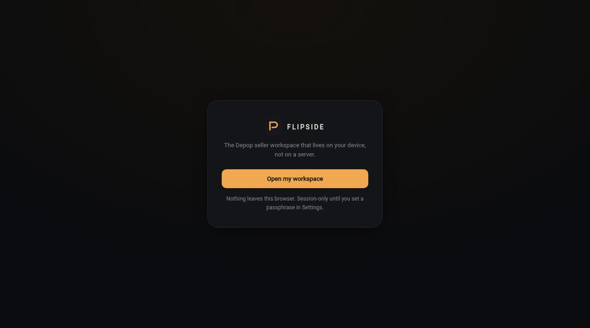

# Flipside

A local-first back office for Depop sellers.



**Live:** https://aeiouvcode.github.io/flipside/

## About

- **Listings:** write titles, descriptions and hashtags from item details, in a choice of tones
- **Photos:** square crop or pad, light and color adjustments, a backdrop remover, JPG/PNG export at 1280x1280
- **Orders:** log sales and see what you keep after fees
- **Niche lab:** research ideas for what to source next
- **Board:** 14-day profit and a daily goal

Everything stays in the browser. Photos are never uploaded. The workspace can be locked with a passphrase and is encrypted with the Web Crypto API. Sample data can be loaded to try it and wiped in one click.

## Run locally

```sh
git clone https://github.com/aeiouvcode/flipside.git
cd flipside
python3 -m http.server 8000
```

Then open http://localhost:8000.

## Layout

```
index.html   app shell
app.js       application logic
styles.css   styles
docs/        README assets
```
